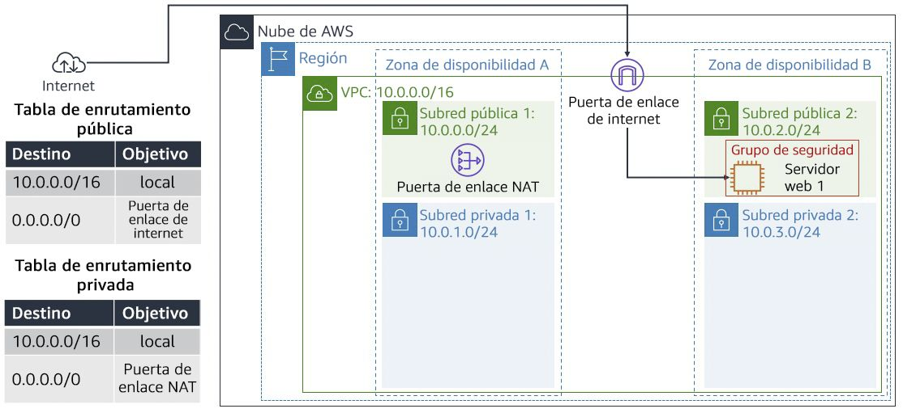
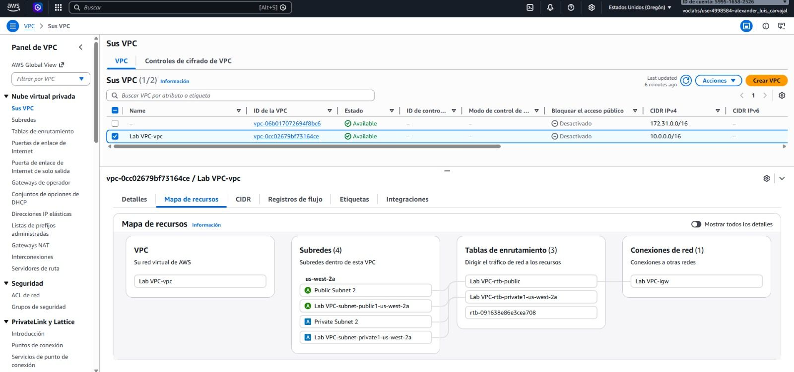
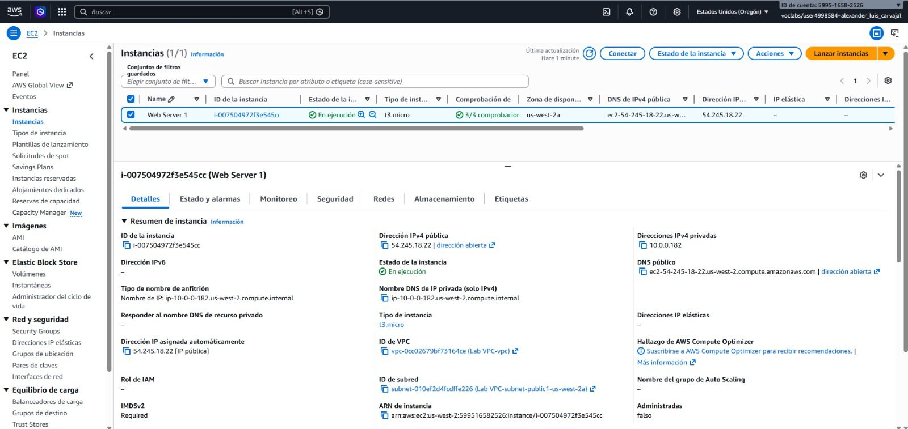
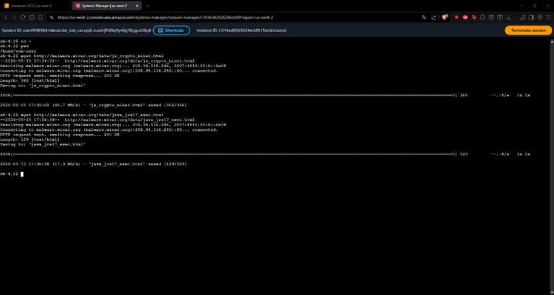

# 🌐 Arquitectura de Red Multi-AZ Empresarial en AWS

## 📋 Resumen del Proyecto
Diseño e implementación de una infraestructura de red altamente disponible y tolerante a fallos en **Amazon VPC**, distribuida en múltiples Zonas de Disponibilidad (Multi-AZ). La arquitectura separa de forma estricta las capas públicas y privadas mediante subredes dedicadas, tablas de enrutamiento independientes y puertas de enlace (**Internet Gateway** y **NAT Gateway**) para garantizar el aislamiento de recursos y la salida segura a internet.

---

## 🎯 Objetivos e Implementación Técnica
- **Aislamiento de Red:** Segmentación en subredes públicas y privadas distribuidas en `us-west-2a` y `us-west-2b`.
- **Enrutamiento y Salida a Internet:** Configuración de tablas de ruta dedicadas y asociación de **NAT Gateway** para permitir parches e inspecciones desde instancias privadas sin exponerlas a tráfico entrante no deseado.
- **Bastion Host / Acceso Seguro:** Despliegue de instancias **Amazon EC2** para pruebas de conectividad SSH/SSM y verificación del mapa de red.

---

## 📸 Evidencias de Configuración y Despliegue

### 1. Diagrama de Arquitectura de Red

*Diseño estructural de la VPC Multi-AZ con subredes públicas, privadas y sus componentes de enrutamiento.*

### 2. Mapa de Recorrido de Recursos en Amazon VPC

*Vista de mapa de recursos en la consola de AWS confirmando la topología de subredes y tablas de ruta asociadas.*

### 3. Instancias EC2 Desplegadas

*Instancias EC2 activas en la infraestructura dentro de sus correspondientes capas de red.*

### 4. Prueba de Conectividad y Acceso por Terminal

*Pruebas operativas de acceso remoto y verificación del estado del servidor.*

---

## 🛠️ Servicios AWS Utilizados
- **Amazon VPC** (Subnets, Route Tables, Internet Gateway, NAT Gateway)
- **Amazon EC2** (Instancias públicas y privadas)
- **AWS Systems Manager (SSM)**
