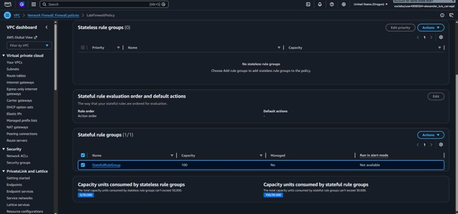

# 🛡️ Inspección Perimetral con AWS Network Firewall y Reglas Suricata

## 📋 Resumen del Proyecto
Implementación de un firewall perimetral con inspección con estado (**Stateful Network Firewall**) para proteger instancias **Amazon EC2** dentro de una VPC privada. La solución utiliza el motor **Suricata** para la inspección profunda de paquetes y el filtrado del tráfico saliente (*Egress*), previniendo la comunicación con dominios no autorizados y la descarga de componentes potencialmente maliciosos.

---

## 🎯 Objetivos e Implementación Técnica
- **Stateful Rule Groups:** Configuración de firmas de inspección basadas en sintaxis Suricata para analizar la capa de aplicación (HTTP/HTTPS).
- **Firewall Policy & Routing:** Integración del endpoint del firewall dentro de las tablas de enrutamiento de la VPC para interceptar el tráfico hacia el Internet Gateway.
- **Validación de Seguridad:** Ejecución de pruebas operativas mediante el comando `wget` desde una instancia EC2 administrada vía **AWS Systems Manager (SSM)**.

---

## 📸 Evidencias de Configuración y Despliegue

### 1. Creación del Grupo de Reglas con Estado

*Confirmación en la consola de AWS Network Firewall tras la creación exitosa del Stateful Rule Group.*

### 2. Comprobación de Tráfico Inicial (Sin Filtro Activo)

*Petición HTTP a un sitio de pruebas ejecutada correctamente (`200 OK`) previo a la aplicación de la política de bloqueo.*

### 3. Validación de Bloqueo Exitoso (Filtro Suricata Activo)

*Interrupción y retención de la conexión saliente al intentar conectar con dominios restringidos tras activar la regla Suricata.*

---

## 🛠️ Servicios AWS Utilizados
- **AWS Network Firewall** (Stateful Engine / Suricata Rules)
- **Amazon VPC** (Routing & Endpoints)
- **AWS Systems Manager (SSM)** (Session Manager)
- **Amazon EC2** (Instancia de prueba)
