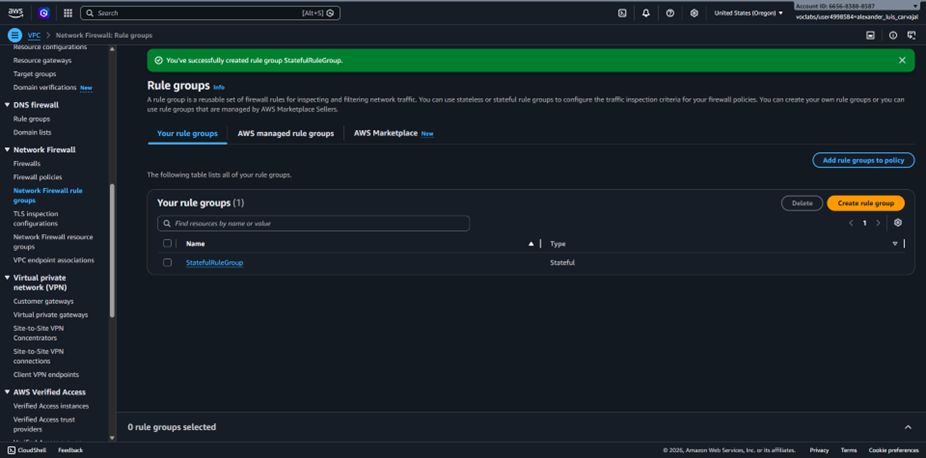

# 🛡️ AWS Network Firewall & Suricata Stateful Inspection

## 📋 Resumen del Proyecto
En este laboratorio se implementó un control perimetral avanzado utilizando **AWS Network Firewall** para proteger cargas de trabajo alojadas en **Amazon EC2**. La solución aplica reglas con estado (*Stateful*) basadas en el motor **Suricata** para la inspección profunda de paquetes y el filtrado del tráfico saliente (*Egress*) hacia internet, previniendo descargas de malware y la comunicación con dominios de alto riesgo.

---

## 🎯 Objetivos e Implementación Técnica
- **Stateful Rule Groups:** Configuración de reglas en sintaxis Suricata para identificar y bloquear firmas de tráfico sospechoso.
- **Firewall Policy & Routing:** Integración del firewall dentro de la VPC para inspeccionar el flujo de red hacia el Internet Gateway.
- **Validación de Seguridad:** Pruebas operativas mediante solicitudes HTTP (`wget`) desde una instancia EC2 administrada por **AWS Systems Manager (SSM)**.

---

## 📸 Evidencias de Configuración y Despliegue

### 1. Creación del Grupo de Reglas con Estado (Suricata)

*Confirmación en la consola de AWS Network Firewall tras la creación exitosa del Stateful Rule Group.*

### 2. Comprobación de Tráfico Inicial (Sin Filtro Activo)

*Petición HTTP a un sitio de pruebas ejecutada correctamente (`200 OK`) antes de aplicar la política de seguridad.*

### 3. Validación de Bloqueo Exitoso (Filtro Suricata Activo)

*Interrupción y retención del tráfico saliente al intentar descargar artefactos maliciosos tras la activación de las reglas Suricata.*

---

## 🛠️ Servicios AWS Utilizados
- **AWS Network Firewall** (Stateful Engine / Suricata Rules)
- **Amazon VPC** (Routing, Subnets & Endpoints)
- **AWS Systems Manager (SSM)** (Session Manager)
- **Amazon EC2** (Instancia de prueba)
