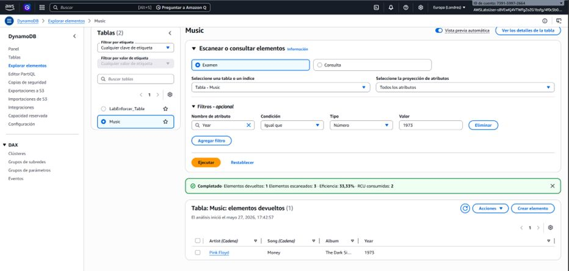
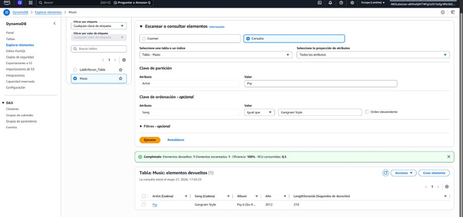
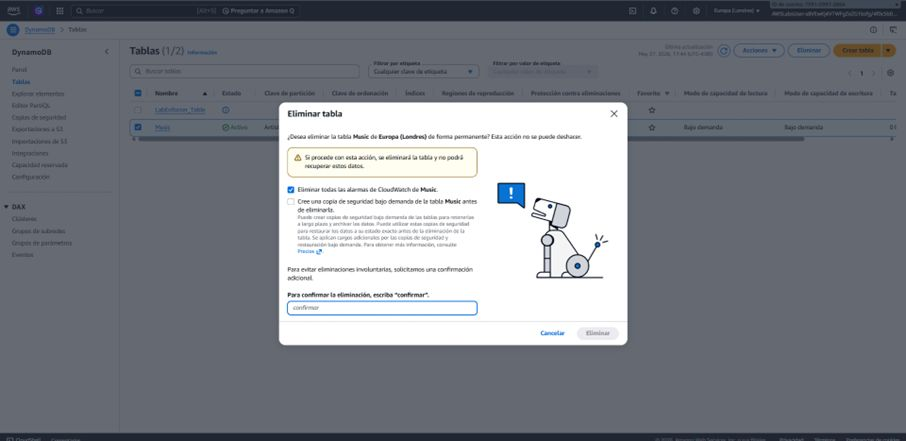

# ⚡ Modelado y Consultas en Amazon DynamoDB (NoSQL)

## 📋 Resumen del Proyecto
Diseño, gestión y optimización de bases de datos NoSQL utilizando **Amazon DynamoDB**. En este laboratorio se exploró el ciclo de vida completo de una tabla (`Music`), aplicando buenas prácticas de diseño de claves primarias (**Partition Key** y **Sort Key**), análisis comparativo de costo/rendimiento entre operaciones de **Scan** y **Query**, y limpieza responsable de recursos.

---

## 🎯 Objetivos e Implementación Técnica
- **Diseño de Claves Primarias:** Definición de una clave primaria compuesta mediante `Artist` (Partition Key) y `Song` (Sort Key).
- **Eficiencia de Rendimiento (Query vs. Scan):**
  - **Scan (Examen):** Evaluación de consumo de unidades de lectura (RCU) al recorrer la tabla completa aplicando un filtro poslectura (`Year = 1973`).
  - **Query (Consulta):** Búsqueda directa sobre el índice primario para maximizar la eficiencia al 100% consuming solo 0.5 RCU.
- **Ciclo de Vida de Recursos:** Eliminación segura de la tabla y desactivación de alarmas asociadas para optimización de costos en AWS.

---

## 📸 Evidencias de Configuración y Despliegue

### 1. Operación de Examen (Scan) con Filtros

*Ejecución de un Scan con filtro `Year = 1973`. Se observa una eficiencia del 33.33% y un mayor consumo de RCU al evaluar múltiples elementos.*

### 2. Búsqueda Optimizada mediante Consulta (Query)

*Ejecución de un Query por `Artist` y `Song`. Se alcanza el 100% de eficiencia y se reduce el consumo a 0.5 RCU.*

### 3. Eliminación Segura de Recursos

*Confirmación y depuración final de la tabla para evitar costos imprevistos.*

---

## 🛠️ Servicios AWS Utilizados
- **Amazon DynamoDB** (Tables, Query, Scan, Capacity Units)
- **AWS CloudWatch** (Monitoreo y alarmas integradas)
