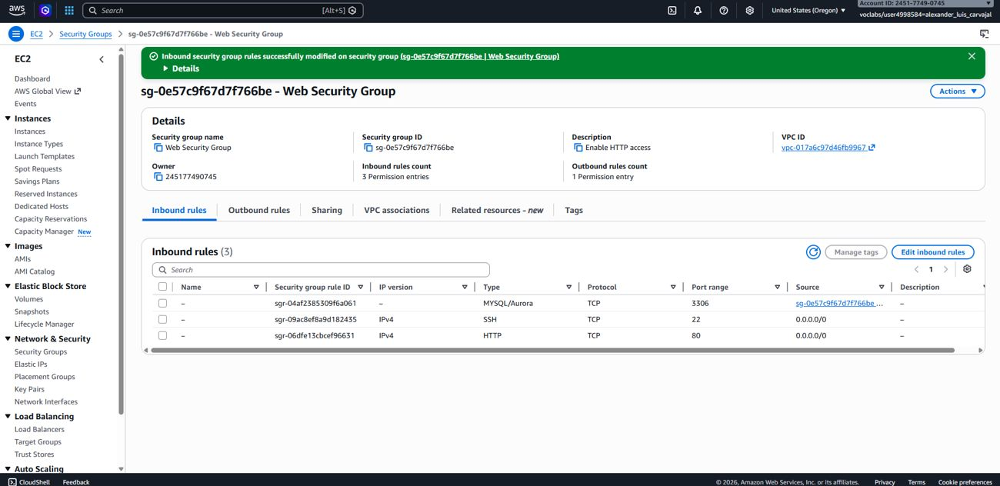
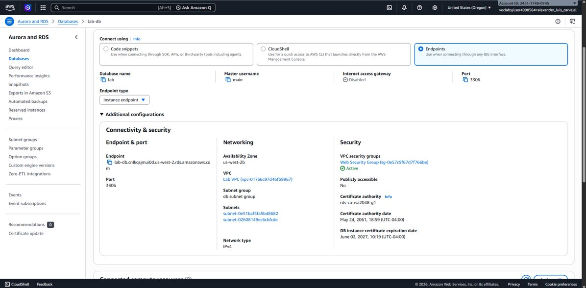
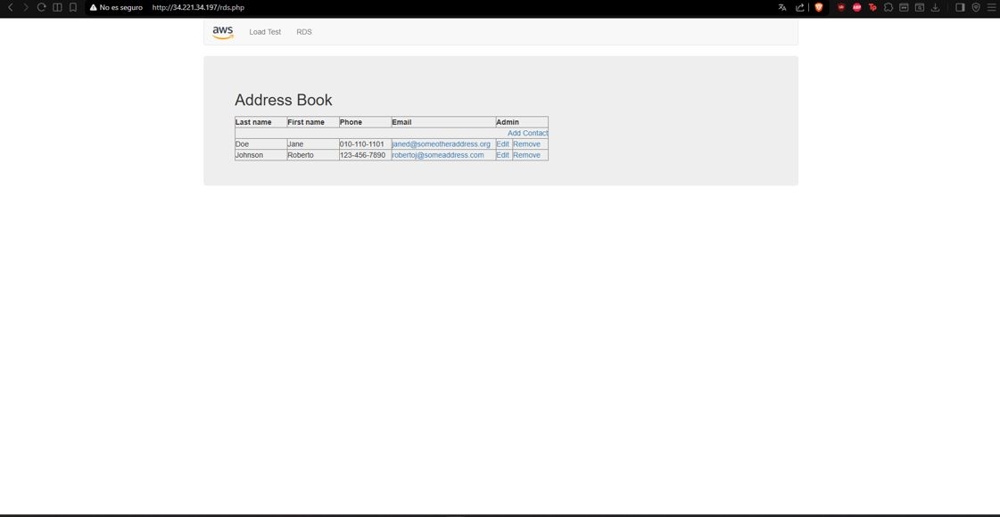

# 🗄️ Conectividad Web-to-Database en AWS: Amazon RDS & Security Groups

## 📋 Resumen del Proyecto
Despliegue y resolución de problemas de conectividad (*troubleshooting*) entre un servidor web EC2 y una base de datos **Amazon RDS (MySQL)**. Durante la implementación se identificó y solucionó un fallo de comunicación (*Gateway Timeout*) ajustando la capa de seguridad lógica de la VPC mediante **Security Groups**, logrando persistencia de datos segura y de alta disponibilidad.

---

## 🎯 Objetivos e Implementación Técnica
- **Aislamiento de Capas:** Configuración de la instancia RDS en subredes privadas no accesibles directamente desde Internet (`Publicly Accessible: No`).
- **Seguridad e Inbound Rules:** Configuración de reglas de entrada en el grupo de seguridad para permitir tráfico en el puerto **3306 (MySQL)** entre el servidor de aplicaciones y la base de datos.
- **Validación de Persistencia:** Despliegue de una aplicación web PHP ("Address Book") que ejecuta operaciones de lectura y escritura en la base de datos relacional.

---

## 📸 Evidencias de Configuración y Despliegue

### 1. Configuración de Inbound Rules en Security Group

*Modificación exitosa de las reglas de entrada, habilitando el puerto 3306 (MySQL/Aurora) para la comunicación entre instancias.*

### 2. Configuración de Red y Seguridad en Amazon RDS

*Detalles de la base de datos `lab-db` dentro de la VPC, mostrando el endpoint de conexión en la zona de disponibilidad `us-west-2b`.*

### 3. Aplicación Web Conectada y Operativa

*Interfaz de la aplicación conectada correctamente a RDS, permitiendo la creación y renderización de registros en tiempo real.*

---

## 🛠️ Servicios AWS Utilizados
- **Amazon RDS (Relational Database Service - MySQL)**
- **Amazon EC2 (Elastic Compute Cloud)**
- **Amazon VPC (Security Groups, Subnet Groups)**
