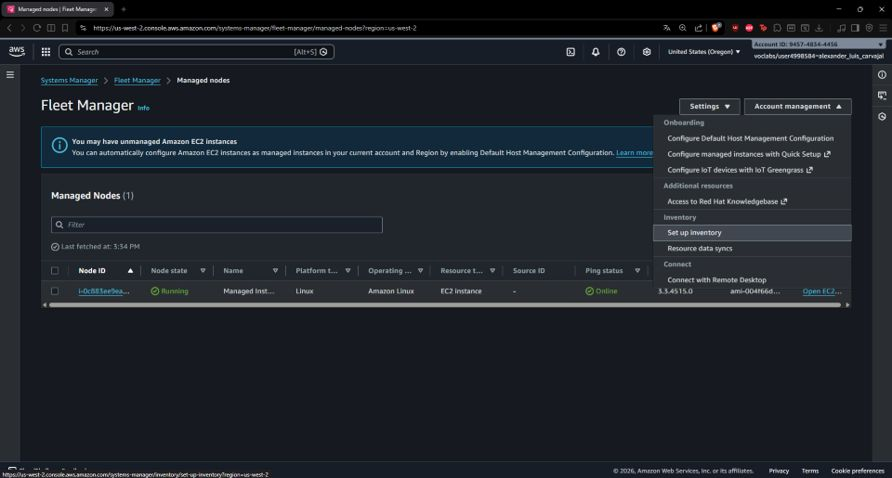
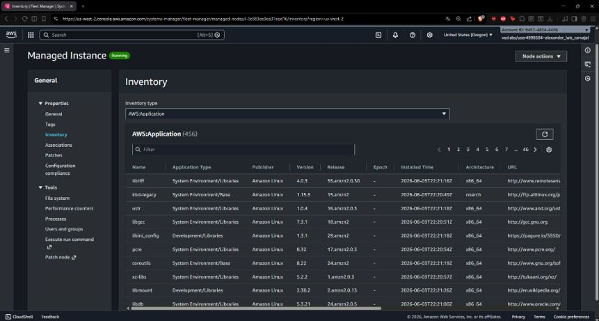
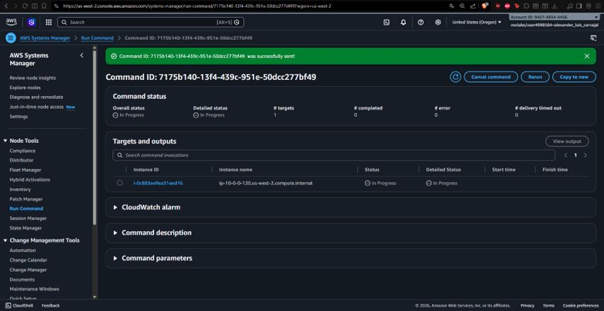
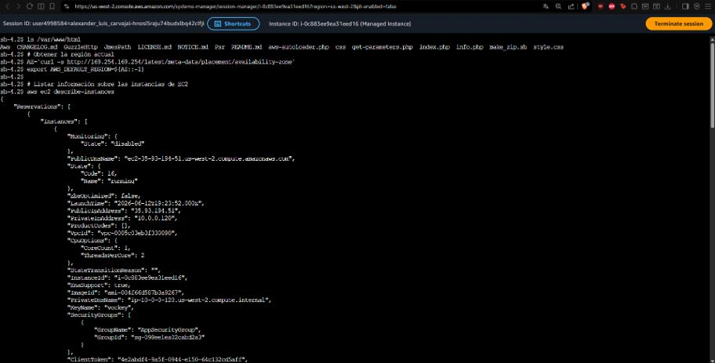
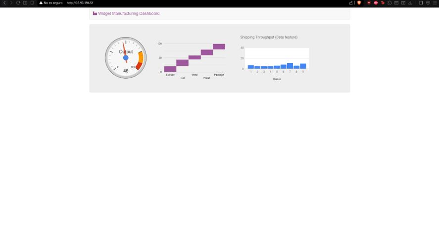

# ⚙️ Automatización y Gestión de Infraestructura con AWS Systems Manager

## 📋 Resumen del Proyecto
Implementación de administración centralizada, automatización operativa y control de parámetros dinámicos sobre flota de servidores utilizando **AWS Systems Manager (SSM)**. Se eliminó la dependencia de conexiones SSH tradicionales y la exposición de puertos administrativos, aplicando el principio de mínimo privilegio e infraestructura como código operativa.

---

## 🎯 Objetivos e Implementación Técnica
- **Gestión Limpia y Segura (Session Manager):** Acceso a la shell interactiva de servidores Linux desde la consola web/CLI de AWS utilizando IAM roles, evitando abrir el puerto 22 en grupos de seguridad.
- **Automatización de Despliegues (Run Command):** Ejecución remota y síncrona de scripts de configuración y despliegue de aplicaciones web en nodos administrados de forma masiva.
- **Inventario Dinámico (Fleet Manager & Inventory):** Recolección automatizada del catálogo de software instalado (`AWS:Application`), paquetes del sistema y configuraciones del kernel.
- **Configuración Centralizada (Parameter Store):** Gestión de parámetros y *feature flags* en tiempo real para activar o desactivar características en la aplicación web sin redepliegues.

---

## 📸 Evidencias de Configuración y Despliegue

### 1. Configuración de Inventario en Fleet Manager

*Habilitación de recolección de datos e inventario sobre los nodos administrados por SSM.*

### 2. Recolección Automática de Inventario de Software

*Visibilidad centralizada de aplicaciones y paquetes instalados dentro de la instancia administrada.*

### 3. Ejecución Distribuida con Run Command

*Ejecución y rastreo de comandos remotos en instancias EC2 sin acceso directo SSH.*

### 4. Acceso SSH-Less vía Session Manager

*Acceso seguro a la consola del servidor desde el navegador ejecutando comandos de AWS CLI y consulta de metadatos.*

### 5. Aplicación Dashboard Dinámica (Parameter Store Driven)

*Aplicación web en ejecución cuyo comportamiento y funcionalidades (Shipping Throughput) responden a parámetros de SSM Parameter Store.*

---

## 🛠️ Servicios AWS Utilizados
- **AWS Systems Manager** (Fleet Manager, Run Command, Session Manager, Parameter Store, Inventory)
- **Amazon EC2** (Managed Instances)
- **AWS IAM** (SSM Managed Instance Core Policies)
