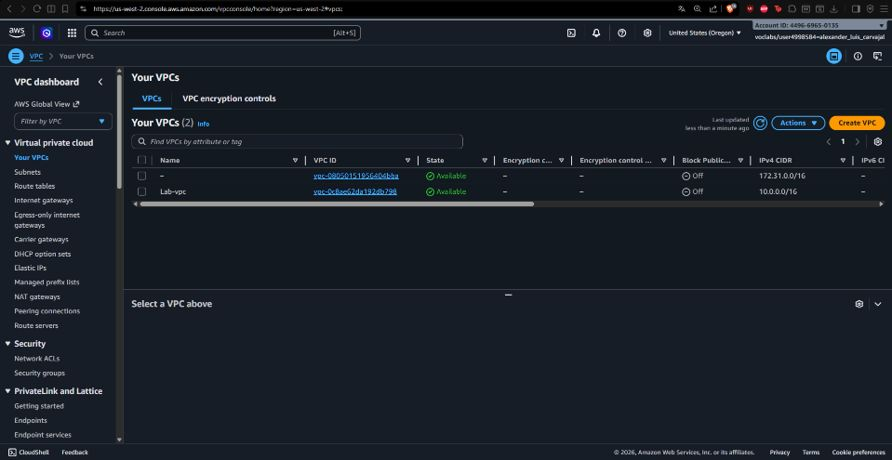
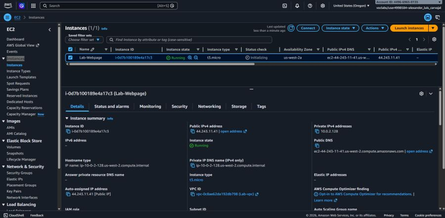
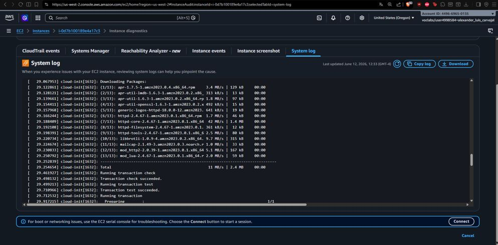
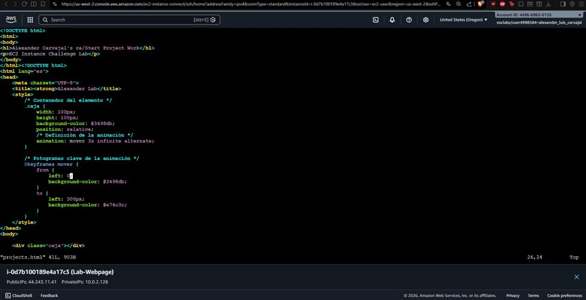
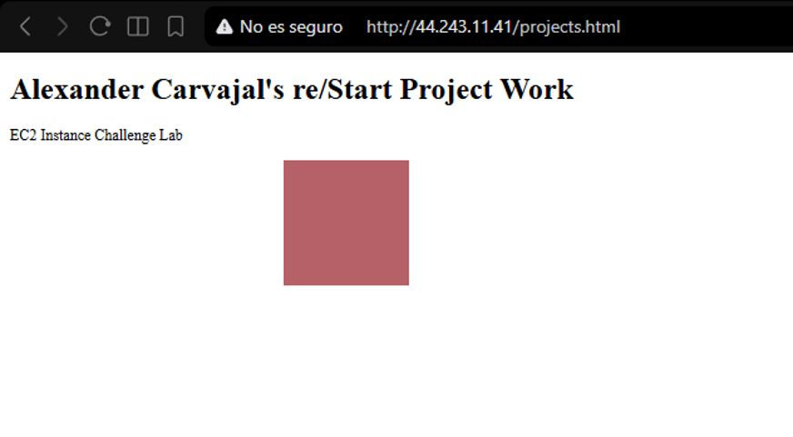

# 🚀 Aprovisionamiento Automatizado de Servidor Web en Amazon EC2 y VPC

## 📋 Resumen del Proyecto
Diseño y despliegue de infraestructura base en Amazon Web Services (AWS) para alojar un servidor web Apache (HTTPD) en una arquitectura aislada. La solución incluyó la creación de una VPC personalizada, la automatización del arranque e instalación del servidor mediante scripts **User Data** (*cloud-init*) y la exposición segura del servicio a Internet mediante Security Groups.

---

## 🎯 Objetivos e Implementación Técnica
- **Aislamiento de Red (VPC):** Creación e implementación de `Lab-vpc` con un bloque CIDR `10.0.0.0/16`, subredes asociadas y tablas de enrutamiento con salida a Internet Gateway.
- **Cómputo Flexible (EC2):** Despliegue de una instancia Amazon Linux 2023 (`t3.micro`) con almacenamiento persistente EBS (gp2).
- **Automatización del Proceso de Bootstrap (User Data):** Ejecución automatizada de scripts durante el primer arranque para instalar `httpd`, habilitar el servicio y desplegar el contenido inicial sin intervención manual.
- **Inspección y Troubleshooting:** Revisión de logs de inicialización (*System Logs*) y acceso remoto por terminal para la personalización de estilos CSS y marcado HTML.

---

## 📸 Evidencias de Configuración y Despliegue

### 1. VPC Personalizada (`Lab-vpc`)

*Infraestructura de red aislada creada con bloque CIDR `10.0.0.0/16` para control granular de tráfico.*

### 2. Despliegue de Instancia EC2 (`Lab-Webpage`)

*Instancia `t3.micro` operativa con IP pública asignada (`44.243.11.41`) y vinculada a la VPC de laboratorio.*

### 3. Verificación de Scripts de Inicialización (cloud-init)

*Revisión del System Log confirmando la descarga e instalación automática del servidor web Apache (`httpd`).*

### 4. Configuración del Servidor Web vía CLI

*Edición y estructura de archivos estáticos (`projects.html`) utilizando reglas CSS y animaciones.*

### 5. Validación del Servidor Web en Producción

*Aplicación web respondiendo correctamente a solicitudes HTTP externas desde el navegador.*

---

## 🛠️ Servicios AWS Utilizados
- **Amazon EC2** (Instances, User Data, EBS)
- **Amazon VPC** (Virtual Private Cloud, Subnets, Route Tables, Internet Gateway)
- **AWS Security Groups** (Inbound Rules: HTTP - Port 80, SSH - Port 22)
