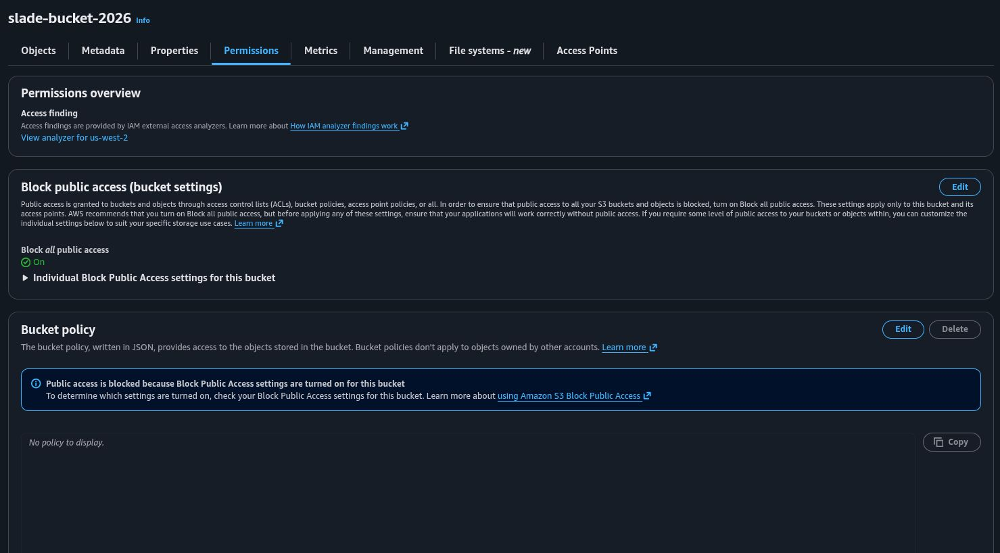
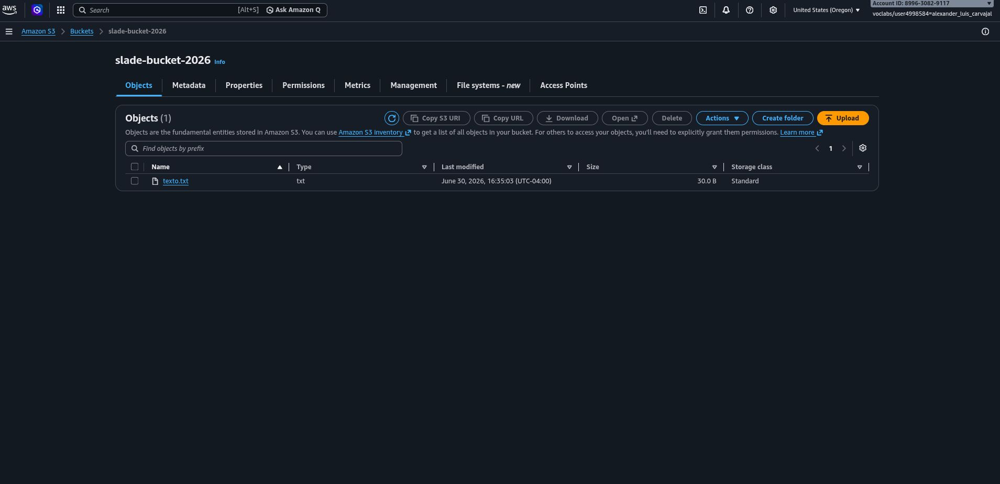
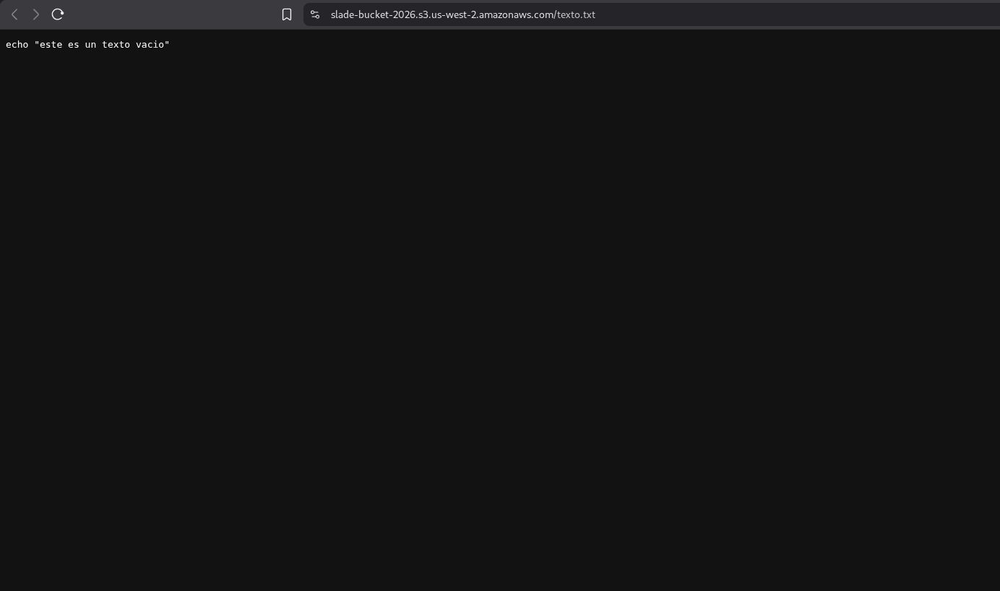
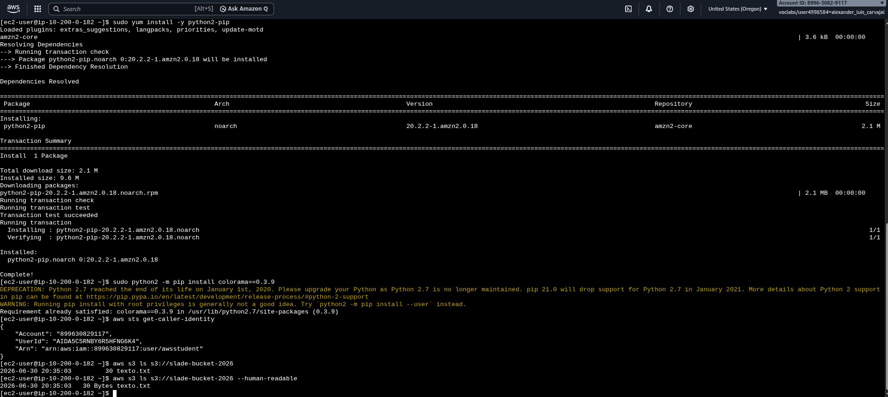

# 🪣 Gestión de Almacenamiento de Objetos y Permisos con Amazon S3

## 📋 Resumen del Proyecto
Implementación y configuración de un bucket en **Amazon Simple Storage Service (Amazon S3)** para la gestión segura de almacenamiento de objetos en la nube. El proyecto abarcó desde el aprovisionamiento e ingesta de datos hasta la exposición pública controlada mediante **Bucket Policies** en JSON e interacción programática a través de la **AWS CLI**.

---

## 🎯 Objetivos e Implementación Técnica
- **Creación de Bucket:** Aprovisionamiento del bucket globalmente único `slade-bucket-2026` en la región `us-west-2` (Oregon).
- **Control de Acceso (Public Access & Policies):** Deshabilitación de *Block Public Access* y adjunto de una política en formato JSON (`s3:GetObject`) para permitir la lectura pública de archivos alojados.
- **Validación del Servicio:** Verificación del acceso público vía HTTPS respondiendo al contenido del archivo `texto.txt`.
- **Operaciones por CLI:** Autenticación e inspección del entorno mediante `aws sts get-caller-identity` y consulta de objetos con `aws s3 ls`.

---

## 📸 Evidencias de Configuración y Despliegue

### 1. Estado Inicial de Bloqueo Público

*Vista previa con la protección predeterminada de S3 (Block Public Access activado).*

### 2. Configuración de Política del Bucket (*Bucket Policy*)
.jpeg)
*Desactivación de bloqueos globales y definición de política JSON permitiendo la acción `s3:GetObject` a principal público.*

### 3. Ingesta de Objetos en la Consola

*Archivo `texto.txt` subido exitosamente en la clase de almacenamiento S3 Standard.*

### 4. Acceso HTTP al Objeto Público

*Verificación en navegador del acceso directo al objeto a través del endpoint público S3.*

### 5. Consultas y Gestión vía AWS CLI

*Ejecución de comandos `aws s3 ls` desde una instancia de terminal para verificar metadatos y tamaño de objetos.*

---

## 🛠️ Servicios y Herramientas Utilizadas
- **Amazon S3** (Buckets, Objects, Bucket Policies, Public Access Settings)
- **AWS CLI** (`aws s3`, `aws sts`)
- **IAM** (Permisos y roles de ejecución)
