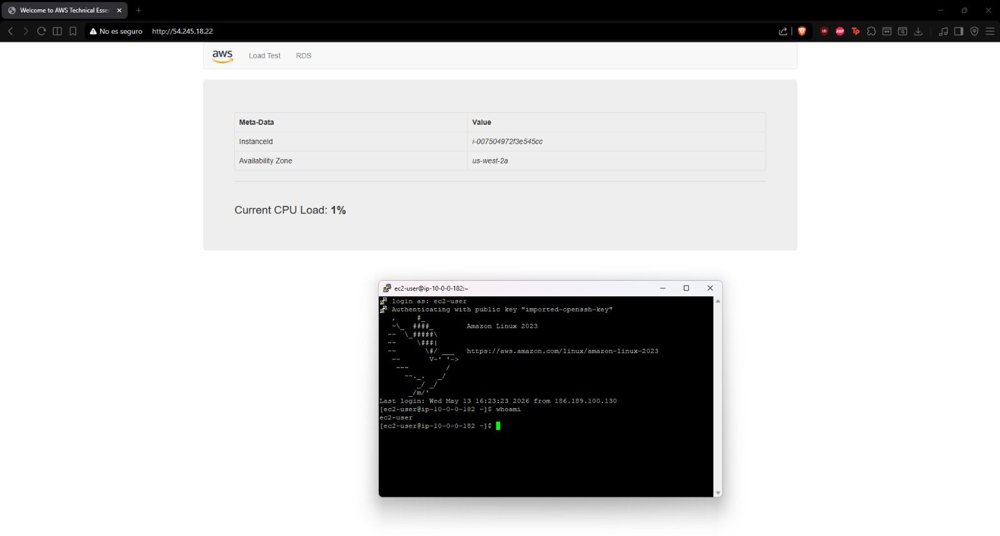

# 🚀 AWS Enterprise Multi-AZ Architecture & Web Deployment

## 📋 Resumen Ejecutivo
Este proyecto demuestra el diseño e implementación de una infraestructura en la nube distribuida, altamente disponible y segura en **Amazon Web Services (AWS)**, siguiendo las mejores prácticas del **AWS Well-Architected Framework**.

El objetivo principal es aislar capas de red críticas, automatizar el aprovisionamiento de cómputo y garantizar que las cargas de trabajo estén protegidas contra fallos a nivel de zona de disponibilidad.

---

## 📐 Diagrama de la Arquitectura

*Diseño conceptual de la topología de red distribuida en múltiples zonas de disponibilidad con capas públicas y privadas.*

---

## 🛠️ Arquitectura de Red y Topología

La infraestructura está desplegada en la región `us-west-2` (Oregon) y cuenta con la siguiente topología:

- **Virtual Private Cloud (VPC):** Bloque CIDR `10.0.0.0/16`.
- **Zonas de Disponibilidad (AZ):** Despliegue Multi-AZ (`us-west-2a` y `us-west-2b`).
- **Subredes Públicas:**
  - `Public Subnet 1` (`10.0.0.0/24`) en `us-west-2a` (Aloja el NAT Gateway).
  - `Public Subnet 2` (`10.0.2.0/24`) en `us-west-2b` (Aloja el Servidor Web EC2).
- **Subredes Privadas:**
  - `Private Subnet 1` (`10.0.1.0/24`) en `us-west-2a`.
  - `Private Subnet 2` (`10.0.3.0/24`) en `us-west-2b`.
- **Gateways y Enrutamiento:**
  - **Internet Gateway (IGW):** Permite entrada/salida de tráfico público a subredes públicas.
  - **NAT Gateway:** Permite salida segura a Internet para recursos en subredes privadas.

---

## 🔒 Seguridad y Configuración de Cómputo

### 1. Servidor de Cómputo (EC2)
- **Instancia:** `t3.micro` ejecutando **Amazon Linux 2023**.
- **User Data / Automatización:** Configuración automatizada de servidor HTTP para entrega de metadatos de la instancia.

### 2. Reglas de Firewall (Security Group)
Se aplicó el principio de mínimo privilegio en el Security Group asignado a la EC2:
- **Inbound HTTP (Puerto 80):** Permitido desde cualquier origen (`0.0.0.0/0`) para el tráfico web público.
- **Inbound SSH (Puerto 22):** Restringido para administración remota segura.

---

## 📸 Evidencia de Despliegue y Verificación

### 1. Mapa de Recursos de la VPC

*Visualización de la estructura lógica de subredes públicas, privadas y tablas de enrutamiento.*

### 2. Estado del Servidor EC2

*Instancia Web Server 1 desplegada correctamente en la subred pública con IP privada y pública asignada.*

### 3. Verificación de Conectividad SSH y Servicio Web

*Acceso SSH mediante consola e inspección de la página web activa respondiendo peticiones HTTP.*

---

## 👨‍💻 Autor
**Alexander Carvajal**
- AWS Certified Cloud Practitioner
- Graduado AWS re/Start
